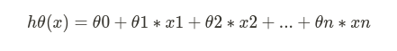
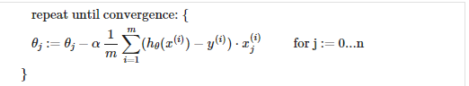
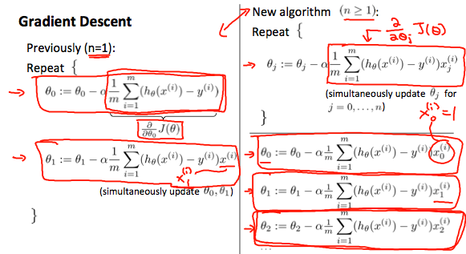
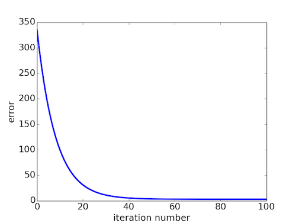
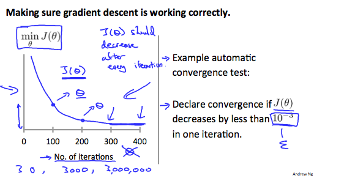
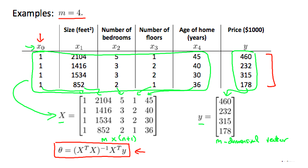

## Prerequisites

If you haven’t read my previous article, in which I walk you through step by step behind the scenes of the Linear Regression Algorithm, where we intuitively build up the entire essence of Math that goes behind it incrementally, you really need to check that out - **Introduction to Machine Learning**. This article is an extension of the previous one and I assume you have had a go at it. In this article, let us deal with the problem where we have multiple features/variables that influence our algorithm. Again, these are the personal notes that I have taken while going through Andrew Ng’s Machine Learning course over at Coursera. Feel free to pick that up if you are interested and the best part is that the course is free.

## BACKGROUND

Notice the picture that I have specifically chosen for this article — Houses. It’s apparent that each home has the potential to be sold at a valuable price. In the previous article, we have dealt with a single feature — That is, we literally built our entire algorithm based on a single factor that might influence the price of a home. Let me make things even more clear of what we are referring to when we say “Features”.

Say you are a resident in one of these homes. And you are planning to sell your home. How would you go about effectively choosing a threshold to which you are supposed to sell? That’s where this algorithm can help. The features, in this problem, are the characteristics of your home. Such as :

- How old is the home?
- The total number of bedrooms that your home has.
- The number of bathrooms that your home has.
- The total area that your home occupies.
- Does it have a parking lot? If so, how many cars can I park?
- Does it have a backyard where I can sit back in the monsoon and read a romantic novel?
- Does it have a swimming pool where I can enjoy the summer?

You can already see, the feature space is blowing up and you can also combine a couple of features and create a new one as well. This is where the feature space comes into the picture and it’s really essential to keep track of what features influence the most, and which do have a greater impact on the performance of the algorithm in the long run.

So, the idea is, to predict the price that your house can be sold based on the “learned examples” which had the same multiple features. If you have understood the above, congratulations! You can now start working on the most famous Kaggle Competition that all beginner Machine Learning aspirants take up — The Housing Prices Competition — This was my first competition as well. Enough of talking, let’s get to Math.

## HYPOTHESIS FUNCTION — REDEFINED

Here, based on the hypothesis we defined in the previous article, if we have a function with multiple variables/features such as x1, x2, x3… xn; then, we would represent the hypothesis function like :

We can choose to represent our hypothesis function in the form of vectors, in many programming languages such as MATLAB and Python, using a vectorial representation increases the computational speed due to the way in which they are designed.

## GRADIENT DESCENT FOR MULTIPLE VARIABLES

Let n denote the number of features given in the data set. Previously, we had n = 1, which is just one feature, but in this, we may have more than 2 features. So the Gradient Descent algorithm has a minor change such as this:

The following image compares gradient descent with one variable to gradient descent with multiple variables:

Note the variable “j” that goes from 0 to n — that is, it iterates all the way from the bias term till the last feature(n). We compute the partial derivatives with respect to each of the features and we update the theta values — the parameter vector. There’s an issue here, do you notice it? We are iterating the entire feature space, computing the gradients, updating the theta values in a single step. And, we inevitably repeat this until the change between these theta values is significantly low. Now, that makes Gradient Descent perform slow. Like, really so slow that you get the urge to just stop learning Machine Learning and go back to your comfort zone. Just kidding, let’s look at a few ways we can improve the overall speed of the optimization algorithm.

## HOW CAN YOU SPEED UP GRADIENT DESCENT?

- We can speed up gradient descent by having each of our input values in roughly the same range so that the contour plots which are highly skewed can be brought down to circles so that the gradient descent would find it easier to get to the global/local minimum.
- We can ideally choose the range of our input values to be between -1 and 1. We can modify the input feature(s) values so that all of them roughly fall in the same range throughout the entire dataset.
- For this, we can use one of the two techniques among a gazillion others. Feature Scaling or Mean Normalization. We can go about writing a whole book upon just this single step, no wonder, there are many already out there. Anyhow, let’s look at what do these two techniques do.
- **Feature Scaling:** In this method, we divide the input values by the range (the maximum value minus the minimum value) of the dataset resulting in a new range of just 1.
- **Mean Normalization:** In this method, we can subtract the average value of the input feature with the input variable and divide it by the standard deviation or by the range of the input feature. Note that dividing it with the standard deviation with yields different results compared to diving it with the range. For example, if xi represents housing prices with a range of 100 to 2000 and a mean value of 1000, then xi = (xi— 1000)/1900.

Now that you understand a couple of steps you that can take to speed up Gradient Descent, how would you go about ascertaining the convergence of the optimization? Did it really learn the parameters, did it reach the global minimum yet? Or is it taking tiny, baby steps still towards the global/local minimum? Or did it just shoot off the contour plot to infinity? Let’s answers these questions

## DEBUGGING THE GRADIENT DESCENT

#### The visual way — Plot the graph

One effective way to visually check if gradient descent is working properly is by plotting. To debug the gradient descent, make a plot with the number of iterations on the x-axis. Now plot the cost function, J(θ) over the number of iterations of gradient descent. If J(θ) ever increases, then you probably need to decrease α.

##### Automatic Convergence Test

Declare convergence if J(θ) decreases by less than E in one iteration, where E is some small value such as 10^−3. However, in practice, it’s difficult to choose this threshold value.

It has been proven that if the learning rate α is sufficiently small, then J(θ) will decrease on every iteration. That doesn’t mean to choose an extremely low learning rate which will potentially slow down gradient descent even more. if α is too small: slow convergence. If α is too large: it may not decrease on every iteration and thus may not converge. So, choose the learning rate alpha wisely depending on the data-set you are dealing with. Tinker around and plot the cost, you will clearly see which alpha value is ideal for your dataset.

## POLYNOMIAL REGRESSION

- Our hypothesis function need not be always linear to fit the data reasonably. In fact, many datasets out there follow a polynomial trend over a linear trend. We can choose to include polynomial terms as well in the function to hopefully get a good hypothesis.
- We can improve our hypothesis function by combining multiple features into one. For example, we can combine x1 and x2 features as x1*x2 and make a new feature x3 = x1*x2.
- Remember, when you are including polynomial terms — feature scaling becomes very important. Because some of the features may shoot to a very large value making the curve quite unstable. Say including the feature x3 = x1\*(x2³). In this case, if the value of x2 is 100, and x1 is 10, then the value of x3 will be 100,000,000 which is very huge. In this case, feature scaling comes handy to drop that value to a desired range so that the curve doesn’t act unstable.

---

## A SNEAKY WAY TO COMPUTE THE PARAMETERS — AVOIDING THE GRADIENT DESCENT

- We can also compute the parameters vector theta using analytical techniques such as using this: theta = inv(X^T _ X) _ (X^T \* y). This is known as the Normal Equation for linear regression.
- There is no need to do feature scaling while finding the parameters analytically. Below shows an example for 4 training examples.

## Putting it all together

If you have made it this far and understood most of it, congrats and give yourself a pat on your back — because you deserve it! You have learned everything that you need to practically apply these concepts to a real-world dataset and generate a predictive model. You have learned about the Cost function, the optimization algorithm — Gradient Descent, computing the parameters analytically, choosing the learning rate effectively, and also debug your algorithm’s performance. Stick them all together in your favorite programming language — You have linear regression.

It was a great journey so far, and you have just breezed through the tip of the iceberg. There’s a lot more you can learn, and believe me, there are many researchers out there who spend their entire lifetime squeezing the point one percent performance out of each of these algorithms, trying different ways to implement hoping for an improvement over the previous version. So, don’t worry, you can get through it with a basic understanding of these concepts.

_So, never, ever stop learning — no matter what!_

> For Precious, with Patience.
