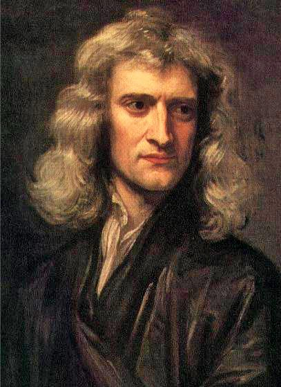
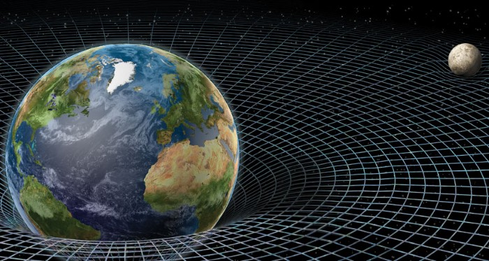
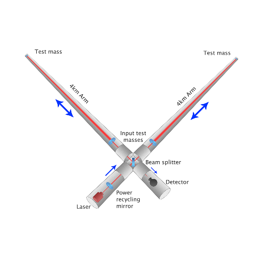

Humans only recently (like in the last 300 years) realized what Gravity is really about. Little over 500 years ago, great minds like Gallio, Kepler found that Earth and other planets revolve around the Sun and Kepler theoretically proved that they move in an elliptical orbit but not in a circle. They only had one question: Why does this even happen?

### How Newton revolutionized thinking about Gravity

Sir Isaac Newton was the first person to feel the influence of gravity in a different way. Until then no one ever noticed that phenomenon but was experiencing it. Great minds always “Question everything.” The legend is that Newton discovered Gravity when he saw a falling apple while thinking about the forces of nature. Whatever really happened, Newton realized that some force must be acting on falling objects like apples because otherwise, they would not start moving from rest. Newton called this force “gravity” and determined that gravitational forces exist between all objects. Using the idea of Gravity, Newton was able to explain the astronomical observations of Kepler. Then, Albert Einstein opened humankind’s eyes to the universe. He developed a whole new concept for gravity. According to Einstein, Gravity arises from the “wrapping” of space and time. His theory for gravity explains a number of phenomena existing in this observable universe but violates Newton’s theory. For example, Light bends while passing near massive objects like the sun. And the clock raised above Earth is faster compared to the clock on the surface of Earth.

### But what is Gravity?

It is a force of attraction that exists between any two objects. Projectiles, Satellites, Planets, Clusters, and Galaxies are influenced by gravity and it is the weakest force in nature.

> Fun fact: the force of attraction between you and Earth is your weight!
> Albert Einstein changes the perspective

### Albert Einstein changes the perspective

Einstein’s theory is illustrated perfectly in this image. Albert was the first one to predict the existence of gravitational waves in 1916 based on his General Relativity theory. General relativity interprets gravity because of distortions in space-time, caused by mass. Therefore, Einstein also predicted that events in the cosmos would cause “ripples” in space-time — distortions of space-time itself — which would spread outward, although they would be so minuscule that they would be nearly impossible to detect by any technology foreseen at that time. 1.3 billion years ago in a galaxy far away, two black holes merged as they violently spiraled into each other. They created traveling distortions in the fabric of space-time. To scale the gravitational waves: just in the last tenth of a second the energy released in these waves was 50 times greater than the energy being released by everything else in the observable universe combined! Out through the universe at the speed of light for over a billion years the waves reached earth where they stretched and squeezed space such that two light beams traveling in perpendicular pipes were put slightly out of step allowing humans to detect the existence of gravitational waves for the first time. It all happened at LIGO (Laser Interferometer Gravitational-Wave Observatory).

That’s a simple enough story to tell but, the main problem with detecting gravitational waves is that they’re tiny. Infinitesimally tiny. To detect such tiny wiggles you have to measure over as large a distance as possible which is why the arms of the interferometers are 4 kilometres and even with arms these long gravitational waves vary the length of the arms by almost 10^(-18) meters so the detector has to be able to reliably measure distances just one ten-thousandth the width of a proton. it’s the tiniest measurement ever made. So, how did they really measure them? They use mirrors to measure these distortions. They call it the Laser Interferometer. Two mirrors hang far apart, forming one “arm” of the interferometer, and two more mirrors make a second arm perpendicular to the first. Viewed from above, the two arms form an L shape. Laser light enters the arms through a beam splitter located at the corner of the L, dividing the light between the arms. The light can bounce between the mirrors repeatedly before it returns to the beam splitter. If the two arms have identical lengths, then interference between the light beams returning to the beam splitter will direct all the light back toward the laser. But if there is any difference between the lengths of the two arms, some light will travel to where it can be recorded by a photodetector.

The space-time ripples cause the distance measured by a light beam to change as the gravitational wave passes by, and the amount of light falling on the photodetector to vary. The photodetector then produces a signal defining how the light falling on it changes over time. The laser interferometer is like a microphone that converts gravitational waves into electrical signals. Three interferometers of this kind were built for LlGO — two near Richland, Washington, and the other near Baton Rouge, Louisiana. LIGO requires at least two widely separated detectors, operated in unison, to rule out false signals and confirm that a gravitational wave has passed through the Earth. LIGO detected these waves on Sept. 14, 2015. It was a significant achievement by mankind that anyone could ever dream of it happening. As he said “The important thing is not to stop questioning. Curiosity has its own reason for existing.” Just keep questioning everything. Never stay calm. And always remember, You can learn anything!

> For Precious, with Patience.
