These are the notes that I have personally taken while I took the Machine Learning course taught by Professor Andrew Ng from Stanford University over at Coursera. It’s free to enroll in the course, which covers the intuitive Mathematics that goes behind classic algorithms such as Linear Regression, Logistic Regression, Neural Networks, and K-Means to name a few. In this article, I shall provide a definitive guide — A simple way to understand the classic Linear Regression Algorithm from the ground up.

## What is Machine Learning?

Arthur Samuel described it as: “the field of study that gives computers the ability to learn without being explicitly programmed.”
A more formal definition has been given by Tom Michel as :
“A computer program is said to learn from experience E with respect to some class of tasks T and performance measure P, if its performance at tasks in T, as measured by P, improves with experience E.
Example: playing checkers. E = the experience of playing many games of checkers T = the task of playing checkers. P = the probability that the program will win the next game. In general, any machine learning problem can be assigned to one of two broad classifications: Supervised learning and Unsupervised learning.

- **Supervised Learning** generally has two types of problems: regression problems, and classification problems. When the data is in input-output pairs, you design a learning function that maps a new input to an output based on the input-output pairs learned earlier of the data you have gathered.
- **Unsupervised learning** is when you are given data with no labels, we tend to notice/learn a pattern within the data using Algorithms. For example, grouping the news articles which are similar under one card in Google News. Or, trying classifying your employees under some category given their performance, punctuality, and other features.

In this article, let’s zoom into Supervised Learning, mainly, understand the Linear Regression Algorithm in depth.

## Supervised Learning

We are going to model a function to map the best fit line to the given data. For example, predicting the housing prices given a data set of 100 houses sold at different prices. We shall model a linear function and use it to predict a new data point with a given set of features. This is with respect to Regression problem statements. Whereas in a classification problem statement, we have discrete output values of which we are predicting using the model based on the data give. For example, the classification that someone is suffering from cancer — Which is either a 0 or 1 — A Yes or No.

## Linear Regression — An In-depth Overview

It is always a best practice to understand the entire Mathematics that goes behind this algorithm in a step-by-step, piece by piece fashion. Straight up pulling off the Hypothesis function, Cost, Optimization and, all the good stuff that goes in a few paragraphs might eventually leave you with utter ambiguity. Therefore, we shall go one step at a time. Let’s get started.

### MODEL AND COST FUNCTION

- So basically, we are given a data set that has input and output pairs. Some basic terminology related to this data set is this:
- m = The total number of training examples. Let x denote a feature given in the set, and y denote the output. Then a pair (xi, yi) is called a training example. There may be multiple features, x1i ,x2i..xni which has only one output; yi. We now describe a hypothesis function h(x).
  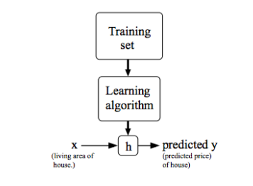
- The hypothesis takes in the parameters theta with which we compute the best fit line (regressor line). When we have a single feature, say, x, then the hypothesis h(x) = theta0+theta1\*x.
- A cost function is used to measure the accuracy of our hypothesis h. This takes the average results of the hypothesis subtracted with the original output values. Here is the representation of the cost function:
  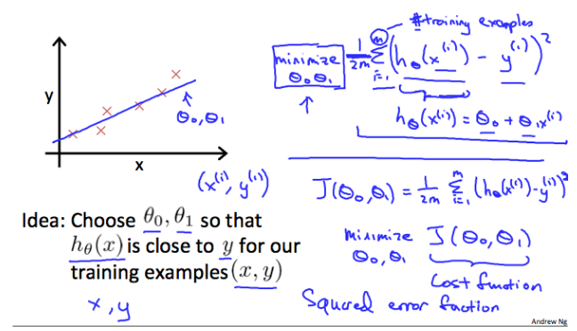
- Our main goal in this is to minimize the cost function to get a very close hypothesis to the data set.

### COST FUNCTION — INTUITION

- When we map the cost function with the x-axis as the input to the hypothesis and the y-axis as the value of the cost function, then the resulting graph would be an ideal parabola. As said earlier, we need to minimize the cost function.

  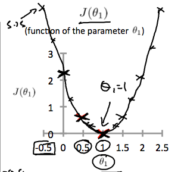
  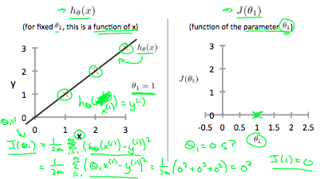

- For the data set of (0,0),(1,1),(2,2),(3,3) the theta0 = 0 and theta1 = 1 is the global minimum of the hypothesis and it fits perfectly which is not always the case — As we shall see the optimization later.

**A brief look at more complicated Hypothesis Functions**

- So, as the number of features of the data set increases, so does the complexity to visualize the graph. So, for two features, we can form a contour plot of the cost function. And for a linear regression problem, there always exists a global minimum.
- The plot of the 2 features cost function may look like this below which is an Elliptical Paraboloid.
  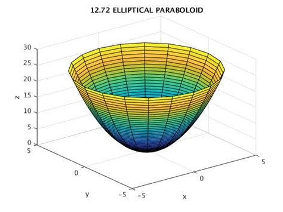
- And the contour plots of the above look as below.
  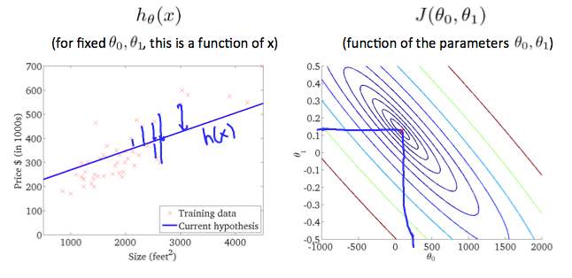

### GRADIENT DESCENT: THE GATEWAY TO THE GLOBAL MINIMUM

- By using the cost function, the hypothesis, we use the gradient descent algorithm to slowly but surely get to the global minimum/local minimum of the given contour plot. The main aim of this is to:

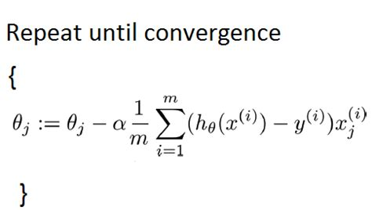

- So, we have the inputs which are theta0, theta1,…thetaN. Here, we update these values according to the gradient descent. We have a learning rate alpha set to some tiny value such as 0.001 which can be varied according to the data set and multiply it with the partial derivative of the cost function with respect to the thetai. (i=1,2,3…n).

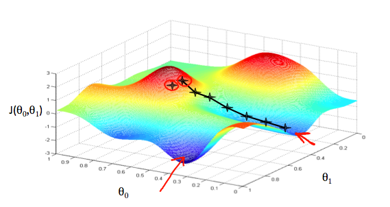

- We are taking tiny steps from the starting point as shown with the view of a direction which makes us go down the maximum.
- An important constraint to keep in mind to achieve a good performing Gradient Descent is choosing the right value of alpha. If the alpha is too small, it may take much time/many iterations to get to a global/local minimum. If the alpha value is too large, then the gradient descent may diverge and shoot off the graph.

### ALGORITHM INTUITION

- Taking into consideration having only one parameter say Theta1, and when its cost function is plotted, we can clearly see the gradient descent in action.
- Our formula for a single parameter was to update theta1 until convergence as stated in the algorithm above. In that, we may have two specific cases:

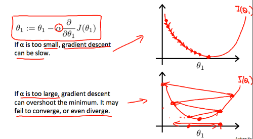

- When the slope is negative, the value of theta 1 is eventually increased.
- When the slope is positive, the value of theta 1 is decreased depending upon the learning rate/alpha.
- The main point here to be noticed is that, as we get closer and closer to the global minimum, the value of the partial converges or tends to zero. Which possibly gets us the best parameter for the hypothesis that we choose.

### LINEAR REGRESSION IN ACTION

- So, the entire algorithm is based off on two main concepts here: The cost function along with the hypothesis and the Gradient Descent Algorithm.
- When the gradient descent finds the global/local min of the given hypothesis, we would have a close fit theta values to predict. More the features, more the theta values. The entire gradient descent for 2 features is summarized below.
  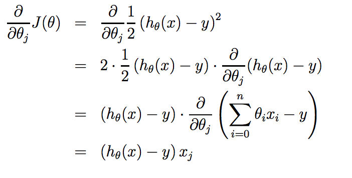
  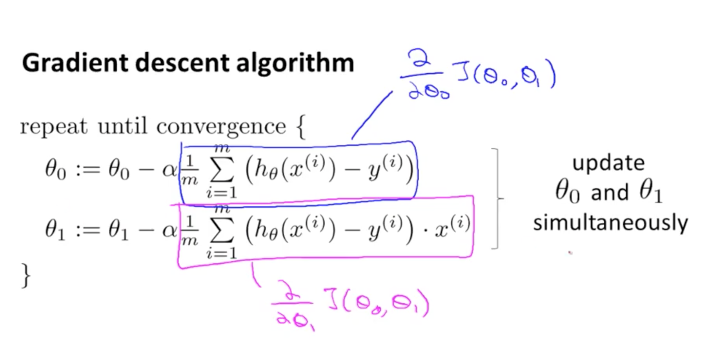

- So, finally applying all these concepts to a data set, would be the linear regression algorithm in action.
  

> For Precious, with Patience.
