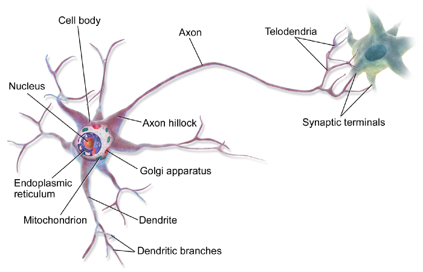
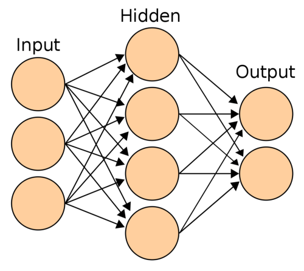

### Introduction to Neural Networks

What just happened? You clicked on this article. Let’s dwell on the seemingly insignificant, but profound details of the mechanics of you “Clicking” this article of which you are totally unaware(hopefully, unless you’re a neuroscientist/neuro student). Your brain is entirely responsible for generating these movements that you consciously or subconsciously think to bring into life. Clicking on this article, or grabbing a water bottle next to you, or instantaneously take off your finger after touching a hot solid. Behind all these general movements that you generate, there are millions of “Neurons” in your brain firing and lighting up the connections that you’ve formed earlier. If you are in awe just like me, here’s what really broadly happens in your brain — There are upper motor neurons that reside in the cerebral cortex of your brain that are responsible for the task that you have decided to do — such as walking, talking, or making a cup of tea. Now, there are CPGs(Central Pattern Generators — A collection of neuronal circuits in the back of your brain) that send these very specific “commands” down your phrenic nerve all the way to your lower motor neurons that make your muscles contract to do the thing you’ve decided to do. That is a lot of stuff in just a few seconds that your brain is able to do. Again, this is just the tip of the iceberg of the behind-the-scenes of each and every action that you perform. And, this pattern of firing is particularly important in the context of learning — of which I would dedicate an entirely new article soon. But in this one, let’s have a gentle introduction to Neural Networks and understand how they work in your brain and how they form the fundamental basis of Deep Learning algorithms.

### Why Neural Networks?

When you were young, you had little to no idea of how things worked. You learned to walk, talk, sing, love, read all on your own. Because of the neurons in your brain. They are integrated into your brain such that you can learn to do literally anything with a considerable amount of discipline and practice. And that’s something that really bothers a computer scientist. They have asked the question “Can we mimic the same network in a computer to make it think?”. This is the motivation for Artificial Neural Networks. One of the most powerful state-of-the-art algorithms of the 21st century.
Back in the day, algorithms have been hypothesized but have never been tested to it’s fullest potential due to the lack of computational resources. But today,(Thanks to Moore’s law) we can spin up a powerful Graphics Processing Unit(GPU — for those gamers who are reading this) and “train” a Neural Network to make a computer literally recognize hand-written digits. No kidding, the accuracy could be so good — that it almost never fails to recognize the correct digit in the given image.

### Brief History of Neural Networks and What are they?

Neural Networks were very widely used in the 80s and early 90s; but eventually, their popularity diminished in the late 90s because it was getting computationally expensive to move further in the field.
A Neural Network is a network or circuit of neurons, or in a modern sense, an artificial neural network, composed of artificial neurons or nodes. This is how a neuron looks like in your brain (Mind you, there are a whopping 86 Billion neurons in your brain which are responsible for your cognitive abilities — such as reading this article).

Those dendrites that you see emerging out of the neuron form connections with other neurons thereby creating this interconnection of a highly complicated structure of which we call a “biological” Neural Network.

### Visualizing Neural Networks

But first, what is a neuron? Literally, think of them as a thing that holds some value in the context of Deep Learning. This value is typically between 0 and 1(glorifying the beauty of nature and computation that is driven by binary) as in a neuron being “activated” if the value is close to 1, else “least activated” if it’s close to zero. There are various mathematical functions that you can use for the activation of a neuron — I will discuss them later in a different article altogether. But, just remember, a neuron is a single computational unit that literally holds a value.

### Artificial Neural Network

It is quite evident from this image that Deep Learning researchers had a knack for organizing these neurons vertically as “stacks” of “layers” while representing them in a computer. This structural organization of the layers is really important in the sense of architecture because even a tiny change in this structure will lead to a completely different result in the sense of learning. The image you see is the most basic ANN which does “Binary Classification”.

Let us break down those “Input”, “Hidden”, and “Output” layers one by one.

- Input Layer — is always the first layer to which you input your data. This data can be of an image(literally, an array/list of pixel values), in that case, you would be doing image classification — For example, trying to recognize a cat in a given image. Again, it totally depends on the problem statement and you should choose the specific algorithm that yields better results.
- Hidden Layer(s) — There can be more than one hidden layer. In the above example, you observe that there exists only one hidden layer. These are literally called the hidden layer for the fact that the **“learning” to “recognize”** the patterns within your data happens within these layers.
- Output layer — As the name goes, this layer is the output of your algorithm. You can have as many neurons as you want to correspond to your output schema, but again, typically the output of a neural network is only one layer. If your output schema is 2 — That is you have two classes to predict either the image consists of a cat or dog, you can have two neurons representing these two classes. The higher the value that the neuron holds, the higher the probability that the data that you’ve provided is leaning towards that class(be it a cat or a dog).

And all the connections that you see from one neuron to all the other neurons in the next layer — They are called associations(in the biological neuron, these are the dendrites) and each of them has an associated “**weight**”. Now, this weight is absolutely the key to the learning that happens.

When you pass your data from the input layer, each neuron in the next layer(which is the first of the hidden layer(s)) activates due to an activation function that takes in values of each neuron from the previous layer, in this case, the input layer. Now, by making use of these weights that each neuron of the previous layer associates with that specific neuron in the hidden layer, the activation of the neuron(s) of the hidden layer(s) are computed. If you compute the activations of all the neurons of the hidden layers and move forward all the way to the end to the output layer in this fashion — It’s called **“Feed-Forward”.** This is where the learning begins. Using an algorithm(such as **backpropagation** — which I will cover later) we adjust these corresponding weights according to the training data and the output of the neural network. The key is to adjust these weights in such a way that the neural network learns to recognize the patterns within the image and be able to produce the desired output.

That was a lot! I tried to be as succinct and concise as possible to draw the basics of the entirety of Artificial Neural Networks in one shot. If you have understood most of it, but still have a few gaps — Do not worry, I have been there as well. Just a little bit of reading again and research will do the trick. In the next one, I will go over the technical details of the implementations and even talk about the backpropagation algorithm. Until then, keep learning. And always remember, “You can learning anything!”.

> For Precious, with Patience.
