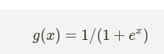
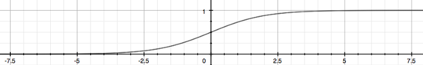
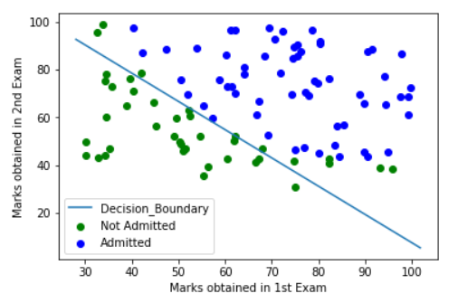
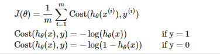
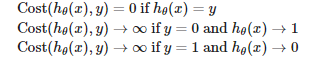
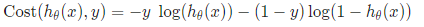
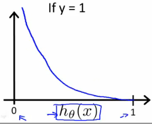
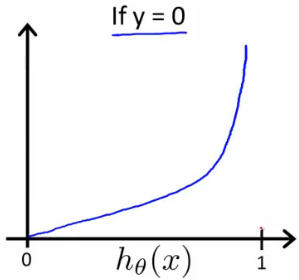
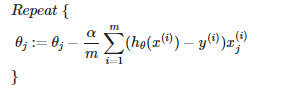

In this article, let’s demystify all the hype out there about Cancer Detection, or detecting if an image consists of a Dog or a Cat, or perhaps even detect if the mail you received last week which reads: “Hey, you won a lottery” is spam or not. Fundamentally, all these problem statements can be categorized broadly under— Classification. These types of problems are quite exciting because the range of problem sets that you can find under the classification realm is immense and they are very intriguing and gives you that thrill to work on them and hopefully have that: “Yes, my algorithm can detect a tumor in an MRI image” feeling.

As always, let us work our way through this algorithm from the ground up. I will walk you through the hypothesis representation, activation function, cost function, optimization algorithm. There’s a lot to cover, grab a cup of coffee or your favorite beverage and read through!

---

## What is Logistic Regression?

Logistic regression is a method for classifying data into discrete outcomes. For example, we might use logistic regression to classify an email as spam or not spam. What do I mean when I say: “Discrete outcomes”? — When you have to predict a value of a discrete class interval. That is, in the case of cancer detection you have two distinct classes that you can predict. Either the patient is diagnosed with cancer or is not. Here there are only two values in our class interval. A Yes, or a No. Positive or Negative. True or False. 1 or 0. No wonder, these two bits have ruled all of Computer Science and Electronics.

To attempt classification, we can simply map all predictions greater than 0.5 as 1 and all less than 0.5 as 0 to represent a binary system. However, this method doesn’t work well in all cases of Machine Learning problems. We need to design something better than that. Classification is just like a special case of regression, except that in this case, we are interested in classifying the given data point into discrete classes namely {0, 1, 2… n}. Let us now define the Hypothesis function.

## Hypothesis Function Representation

Here, we are dealing with binary classification, we need to model the hypothesis function to take values and strictly predict the outcome between 0 and 1. It doesn’t make sense to predict greater than 1 or less than 0. To fix this, there’s a classic function that maps your input between zero and one. That is the sigmoid function, also called the Activation Function in the context of Deep Learning.

It always helps to visualize the functions. Here’s the representation of the above expression:

It’s evident, that as the input to the above function grows larger, the output of the function tends to 1. Remember that the function g(x) tends to 1 as x tends to positive infinity and vice versa. Now, using this, we shall proceed in defining the hypothesis function as follows:

But how does all this work in our case? — The “X” is a vector representing the features of the particular problem statement that you choose and that’s multiplied with the optimized theta values. When you pass this result into the sigmoid function , you would get a vector of values representing the probability between 0 and 1. The lower the value, the closer it is to the class “No” and the higher the value, the closer it is to the class “Yes”. As simple as that. Sounds good? Now, let’s talk about Decision Boundaries.

## Decision Boundary

Let’s learn about this the fun way. Assume that you are joining a new institution. They conduct a couple of tests before you join and based off on the score you’ve got — they shall decide if you’re in or not. Let’s call those that get in as “Admitted” and those that aren’t as “Not Admitted”. You have a few data points of the students that got admitted and that haven’t previously based on their scores and you plotted them. This is how it looks like:

Now you see how important Decision Boundaries are when you can visualize them. You can draw a conclusion based off on intuitive inferences of a new datapoint once you have the decision boundary for the algorithm you’ve trained. In the above case, a linear decision boundary has been obtained by our algorithm — which undoubtedly can be non-linear as well when the data is quite scattered around. That is, you can input non-linear complex functions to the sigmoid activation. But, it shall come with a trade-off if not handled properly — The problem of Overfitting. More on that later in a different article!

## Cost Function

We do not want to use the same cost function that we used for linear regression - [[Introduction to Machine Learning]] because the logistic function will cause the output to be wavy, causing many local optima. In other words, it will not be a convex function. Instead, our cost function for logistic regression looks like this:

Notice that with a simple if/else condition we can choose to define the cost function for that specific training example depending upon the variable “y”. When the value/output for that training example is of class “1” or “True” or “Yes” or “Cancer” or anything positive — we define the cost to be the negative logarithm of the hypothesis function. When it’s “0” or “No” or “Negative” or “Not Cancer”, it’s the negative logarithm of one taken away from the hypothesis. If all this sounds complex, there’s a neat trick to simplify this:

You can define the cost function in one line as above. We use the variable y so that whenever it’s 1 — the value (1-y) on the right-hand side will nullify the multiplicand, making the cost function specific to a positive example. It’s the same in the other case when y is 0. Let’s visualize the cost in both of the cases:

When the value of the output is 1, we see that whenever the hypothesis output’s values closer to zero — that’s when your algorithm is messed up. That’s when the cost should go up and you can see it in the graph as well.

Similarly, when you have the output of the training example to be zero and your hypothesis is also producing values that tend to zero, that’s when you ascertain that your algorithm is working well. From the graph, it’s evident that the cost also tends to zero.

## Gradient Descent

The general form of the gradient descent algorithm is as follows and we shall use the same for this algorithm as well.
If you are unsure about how this works, head over to my other article — [[Introduction to Machine Learning]] wherein I talk about this optimization algorithm in exquisite detail leaving you with a deep insight into how it actually works with contour plots included.

## Logistic Regression In Action

That’s it and if you’ve made it this far — congrats and pat yourself on your back! You can now implement binary classification using the concepts learned above. Pick up any programming language and implement the above and you should have Logistic Regression up and running! We have covered the fundamentals of classification — The problem statement and redefined the Hypothesis Function, learned about the classic Sigmoid Function, understood how the cost function works, and most importantly, you should be able to debug the performance of the algorithm based off on cost plots.

This is just the beginning of your journey into the world of classification. You can do a lot here. A lot of cool stuff that layman considers as a superpower. From self-driving cars to potentially detecting cancer. With this, you have also indirectly learned about Neural Networks — A state of the art Deep Learning algorithm. Logistic Regression is more of an abstract representation of a single layer Neural Network. I plan to write more about them soon, so stay tuned.

_Until then, never stop learning and trust me, You can Learn Anything!_

> For Precious, with Patience.
