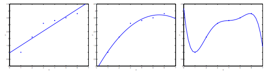
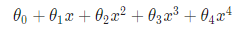
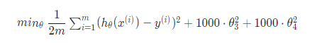
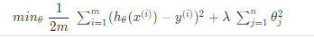
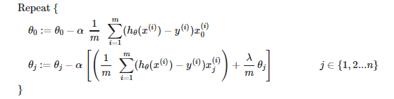
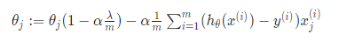
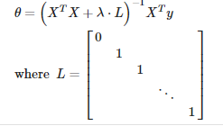
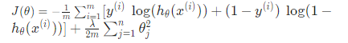
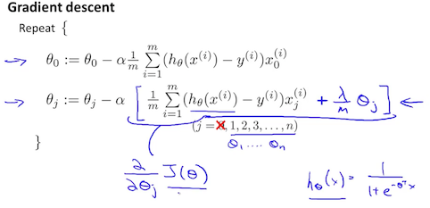

In this single article, **let’s address the problem that plagues all of Machine Learning.** I assume you have read my previous article(s) wherein I introduce you to Machine Learning and walk you through a few classic algorithms. The prerequisites for this article are that you should be familiar with at least a single algorithm, be it Introduction to Machine Learning, At what price should you sell your home - Multivariate Linear Regression, Lets Learn the Fundaments of Classifying Cancer - Logistic Regression, or others. I have linked the articles and you can click and read through them! — Anyone from the above would be sufficient to understand the concepts laid out in this article. Let’s get started!

## Introduction

Alright, so you have gathered all the data that you need and preprocessed it, you took care of all the features that you would like to include and remove those that you don’t. Before we go directly into the problem, let’s learn about some technical jargon regarding data so that we are on the same page.

**Training Data/Set** is the collection of data points and it’s the starting point that you train your algorithm upon. Sounds simple? Yes, you use this data to learn and recognize a pattern from the data and hopefully form a good hypothesis.

**Validation Data/Set** is the collection of data points that the algorithm you’ve trained has never seen before. You decide the performance of your algorithm based on the predictions that you gather from feeding this data to your model. Solely based on the performance of your model upon this set, would you be able to decide if it’s working as expected or not.

**Testing Data/Set** is like the last resort. Of course, your model doesn’t know these data points, but this is the final evaluation step. You tweak your model based on the insights you’ve gained from the previous set’s performance and test the algorithm upon this set.

Why am I talking about all these? You see, when you train an algorithm — be it a regression problem statement or a classification, the data is all that determines how good your model can work in the long run. As the quote goes:

_In the end, it is not the one who has 99% accurate model that wins, but the one who has a lot of data._

## Overfitting & Underfitting

Now that we have a brief idea of the technical terms such as Training, Validation, and Testing sets — for the sake of simplicity, let’s focus the performance of the algorithm on the first step, which is the training set. Assume that you have trained a model three times. After each time you trained, you have checked the performance of your algorithm by plotting the best-fit curves against a few data points. And these are the graphs you’ve obtained:

From the above picture, you can draw a few key insights. They are:

- First Plot: We are clearly underfitting the data. In this case, we are using a linear function that doesn’t give the optimal prediction for new data points. Notice that whatever you do, the curve is linear when you do not include the polynomial terms and the cost shall remain the same with the best fit line. This can be resolved by including a few polynomial terms making it a non-linear function and hopefully get a better hypothesis. Naively, it might seem that the more features we add, the better the fit to the data. However, this is not the case and you’ll see why.
- Third Plot: If we add too many features, we eventually end up overfitting the training data which is not optimal because if we do so, for the testing data or even the validation data, the output wouldn’t be as close to the true value.
- Second Plot: This is the ideal curve and it is the right hypothesis for the training data provided which doesn’t overfit or underfit it.

**Underfitting**, or high bias, is when the form of our hypothesis function h maps poorly to the trend of the data. It is usually caused by a function that is too simple or uses too few features.
**Overfitting**, or high variance, is caused by a hypothesis function that fits the available data but does not generalize well to predict new data. It is usually caused by a complicated function that creates a lot of unnecessary curves and angles unrelated to the data.

## But, How do we overcome these two issues?

Simply **when you are faced with underfitting** — You can resort to adding more features and also include a few polynomial terms or even combining existing two features and making up a new one. You are free to do that, but it does come at the cost of Overfitting.

In the other case, **when you see your algorithm is overfitting**, there are two of the most common ways you can resolve it. The first one is to simply reduce the number of features that you include for training and manually select the features carefully. The other one is Regularization. The main aim of Regularization is to keep all the features, but reduce the magnitude of parameters θj. And, it works well when we have a lot of slightly useful features. Let’s talk about this in the contest of both Linear and Logistic Regression.

## Regularized Linear Regression

#### Cost Function

When we choose to regularize our algorithm, there are a few changes that we need to make. If we detect overfitting from our hypothesis function, we can reduce the weight that some of the terms in our function carry by increasing their cost. Say we wanted to make the following function more quadratic:

If we want to eliminate the influence of the last two terms without actually removing them, we can modify the cost function as follows:

We are adding those two extra terms at the end to penalize the last two features. And if we are interested in penalizing all the features, we do the following:

Using the above cost function with the extra summation, we can smooth the output of our hypothesis function to reduce overfitting. If λ is chosen to be too large, it may smooth out the function too much and cause underfitting. Hence, we are supposed to pick and tune the value of λ carefully.

## Gradient Descent

We will modify our gradient descent function to separate θ0 from the rest of the parameters because we do not want to penalize θ0 which is the bias term.

You can observe that we added the first term “( 1 — α\*(λ/m)” which will always be less than one and that is responsible for the regularization of each parameter.

## Normal Equation

To add in regularization, the equation is the same as our original, except that we add another term as such:

## Regularized Logistic Regression

#### Cost Function

We can regularize the equation by adding a term to the end of the cost function we defined earlier in the article - Lets Learn the Fundaments of Classifying Cancer - Logistic Regression.

## Gradient Descent

Similarly, we add the same regularization term “(λ/m) \* θj” excluding the bias term which is “θ0". Below shows how we add these modifications to the optimization algorithm for logistic regression.

## Final Thoughts

That was a lot of knowledge in just one go! Don’t feel bad if you weren’t able to get all that, or felt intimidated by looking at those long Math equations. They are very simple if you have read my previous articles or have even an ounce of familiarity with previous concepts I discussed. But, if you got it all, Congrats again! Pat yourself on your back and keep moving forward! As a recap, we have covered the technical jargon that goes into data, learned about overfitting and underfitting — their cause, and how you can resolve them. And we have also covered Regularization with respect to Linear Regression and Logistic Regression in great detail by enquiring the individual pieces that make them up — Cost function, Gradient Descent.

_Never stop learning and trust me, you can learn anything!_

> For Precious, with Patience.
